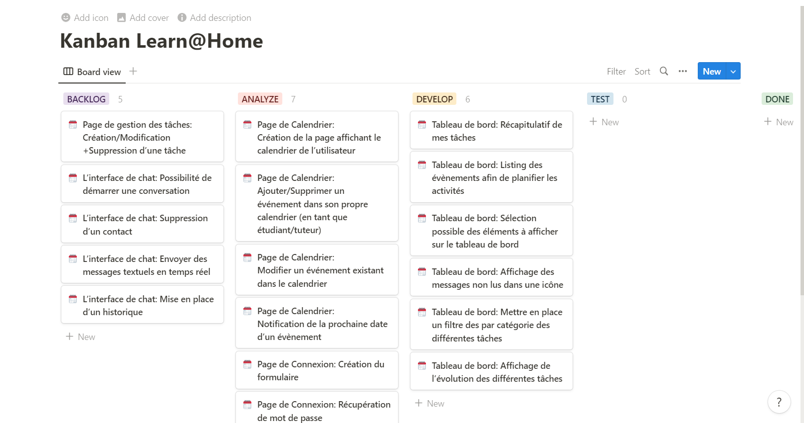
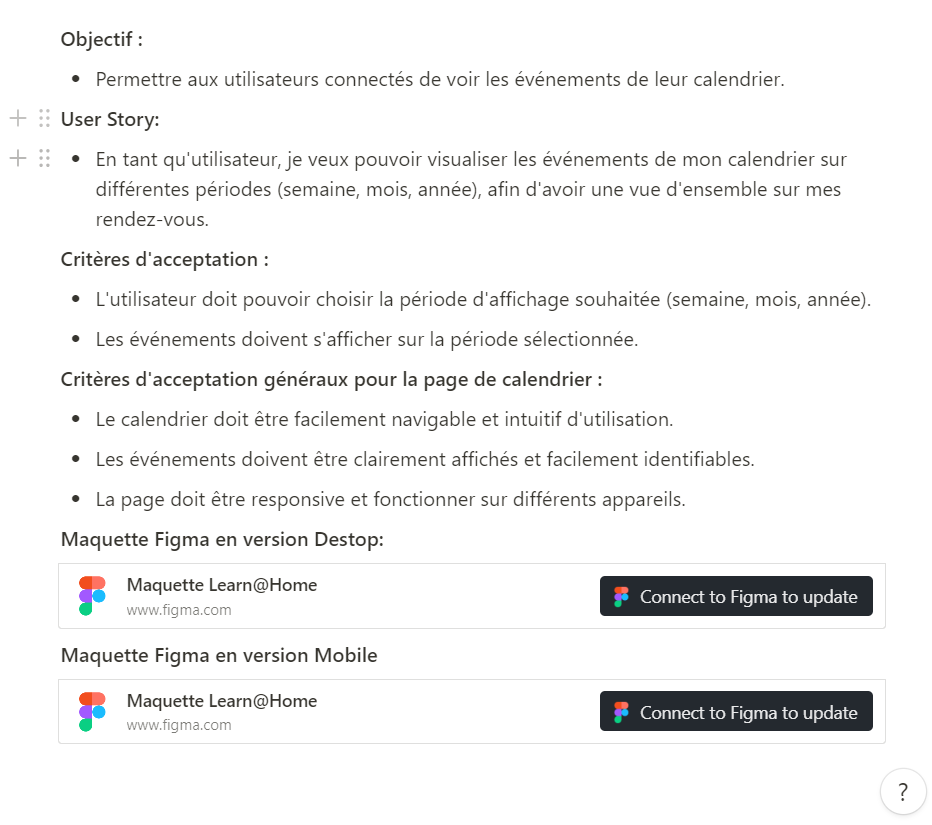
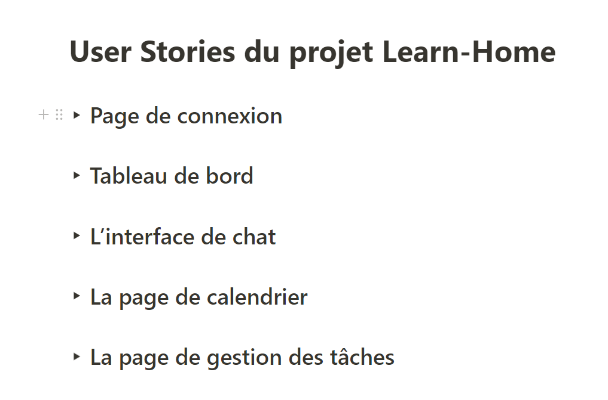
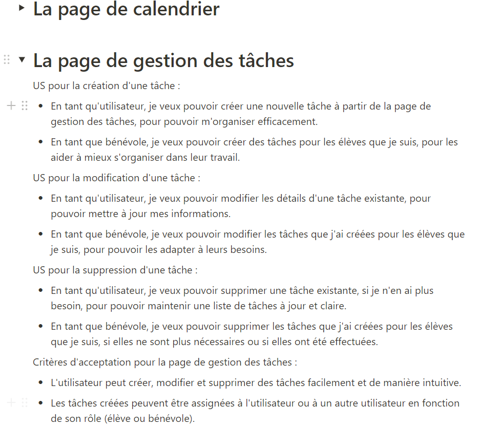
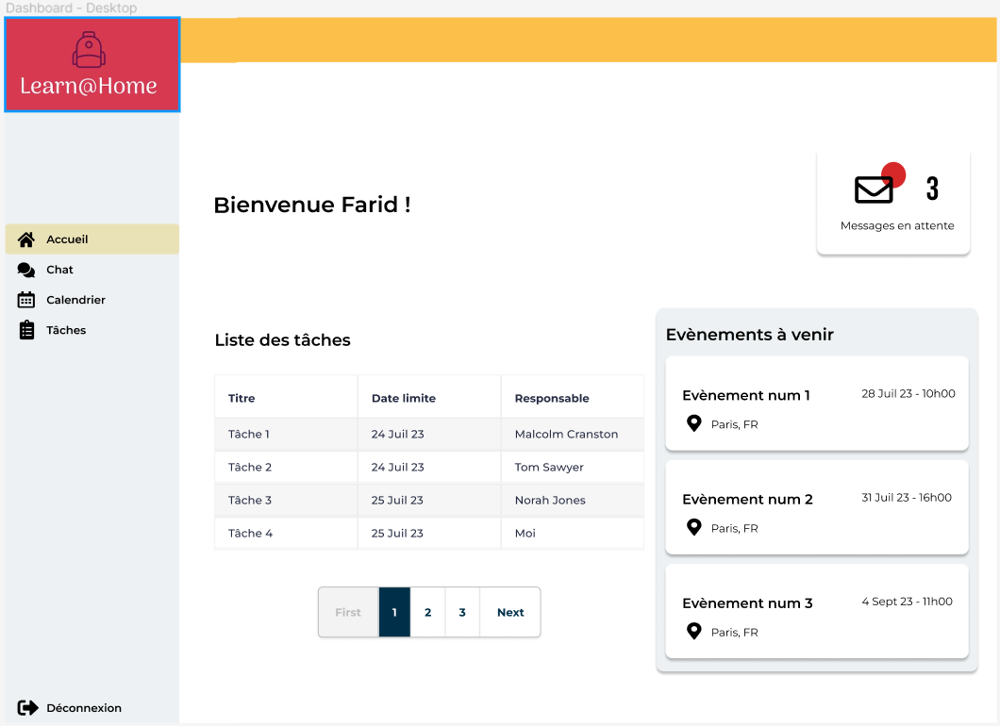
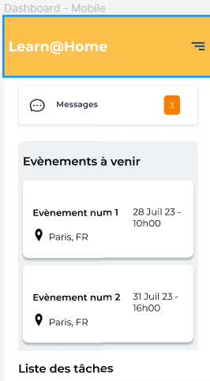
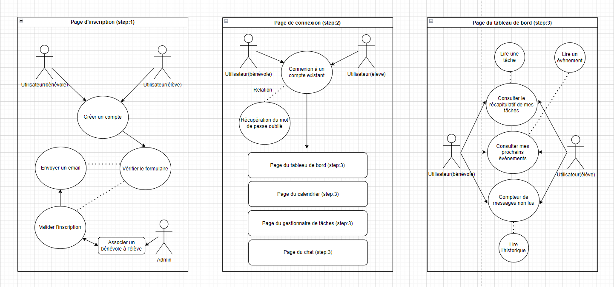
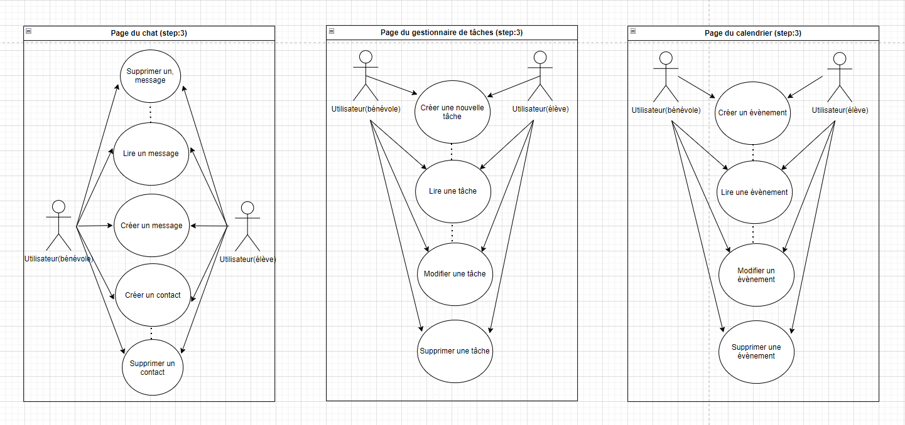
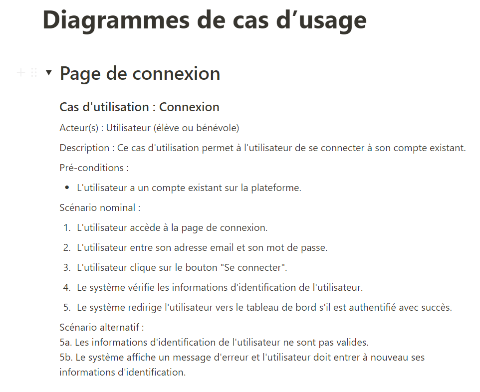

# Learn-Home

## Kanban via Notion:

- Consulter l'intégralité du Kanban via [Notion](https://torpid-yuzu-9e5.notion.site/45dea53b58be483b887c5305696c30bf?v=53c7771d36174d78923379674a179056)
- Cliquez [ici](https://github.com/FaridBF/Learn-Home/blob/main/Kanban/Kanban_Learn%40Home.pdf) pour voir le fichier sous format PDF.

## User Stories via Notion:

- Consulter l'intégralité des User Stories via [Notion](https://torpid-yuzu-9e5.notion.site/User-Stories-du-projet-Learn-Home-8491691374e34ae2ae1a3e23503b90ca)
- Cliquez [ici](https://github.com/FaridBF/Learn-Home/blob/main/UserStories/User_Stories_du_projet_Learn-Home.pdf) pour voir le fichier sous format PDF.

## Models via Figma:

- Consulter l'intégralité des maquettes au format Desktop et Mobile via [Figma](https://www.figma.com/file/QR727Lky6lFQKACPa2fHbq/Maquette-Learn%40Home?type=design&node-id=0-1&mode=design)
- Cliquez [ici](https://github.com/FaridBF/Learn-Home/blob/main/Model/Maquettes.pdf) pour voir le fichier sous format PDF.

## Models via Draw.io:

- Consulter l'intégralité des diagrammes de cas d'usage via [Draw.io](https://drive.google.com/file/d/1tkujCWGHLYBr8pHxPEkAPavHb7_HhiQm/view)
- Cliquez [ici](https://github.com/FaridBF/Learn-Home/blob/main/UseCaseDiagrams/Diagramme-cas-d-usage.drawio.pdf) pour voir le fichier sous format PDF.

- Consulter l'intégralité des différents scénarios pour les diagrammes de cas d'usage via [Notion](https://torpid-yuzu-9e5.notion.site/Diagrammes-de-cas-d-usage-714723086777437db61153ccff821f89)
- Cliquez [ici](https://github.com/FaridBF/Learn-Home/blob/main/UseCaseDiagrams/Descriptifs_diagrammes_de_cas_d_usage.pdf) pour voir le fichier sous format PDF.

# Tools used to create this project:

- [Notion](https://www.notion.so/) is a project management and note-taking tool that allows users to collaborate on projects and integrate them with other tools such as Trello, Kanban, etc...
- [Figma](https://www.figma.com/fr/) for the initial model provided by the FishEye team.
- [Draw.io](https://app.diagrams.net/) is free online diagram software for making flowcharts, process diagrams, org charts, UML, ER and network diagrams.
